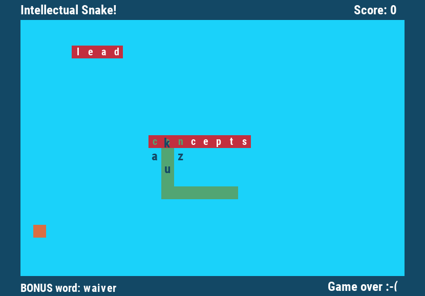

# Intellectual snake

Python/PyGame implementation of the famous arcade game **Snake**. Instead of the standard arrow 
keys, the snake is controlled by randomly generated letters.

*This is one of my projects for the Fundamentals of Game Development course at the University of 
New Orleans*

